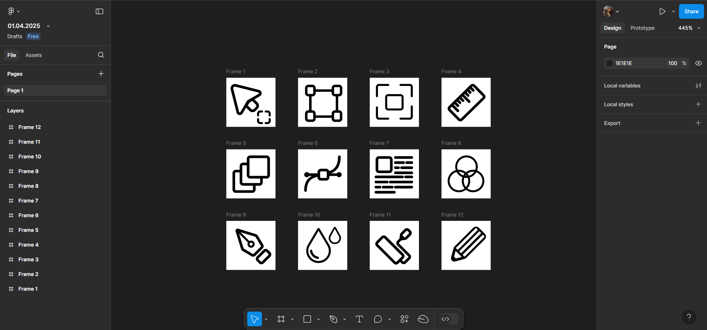

# ПЗ-5(6): Криві Безьє, векторні об'єкти у Figma

## Опанування інструментів
У цій роботі ми вивчимо, як використовувати інструмент **Pen Tool** у Figma для створення кривих Безьє та побудови складних векторних об'єктів.

### Завдання
- Опанувати у Figma інструмент **Pen Tool** для створення кривих Безьє.
- Створити **п'ять(я створив 12)** іконок у **border (обводочному) стилі**.
- Кожну іконку створити в окремому фреймі **(24×24)**.

### Результати

#### Значки у border-стилі  
<table align="center">
  <tr>
    <td align="center">Frame 1</td>
    <td align="center">Frame 2</td>
    <td align="center">Frame 3</td>
    <td align="center">Frame 4</td>
    <td align="center">Frame 5</td>
    <td align="center">Frame 6</td>
  </tr>
  <tr>
    <td></td>
    <td></td>
    <td></td>
    <td></td>
    <td></td>
    <td></td>
  </tr>
</table>

<table align="center">
  <tr>
    <td align="center">Frame 7</td>
    <td align="center">Frame 8</td>
    <td align="center">Frame 9</td>
    <td align="center">Frame 10</td>
    <td align="center">Frame 11</td>
    <td align="center">Frame 12</td>
  </tr>
  <tr>
    <td></td>
    <td></td>
    <td></td>
    <td></td>
    <td></td>
    <td></td>
  </tr>
</table>

### Процес створення
1. Використання **Pen Tool** для побудови базових контурів іконок.
2. Створення точок опор та регулювання кривих Безьє для плавності ліній.
3. Налаштування товщини обводки та стилю ліній.
4. Додавання деталей та коригування форми для досягнення точного результату.
5. Організація іконок у фреймах **(24×24)** для відповідності стандартам дизайну.

### Робочий процес

  

### Висновок
Під час виконання завдання було опановано інструмент **Pen Tool** та принципи роботи з кривими Безьє у Figma. Це дозволяє створювати складні векторні об'єкти з високою точністю. Отримані навички значно розширюють можливості створення кастомних іконок та інших графічних елементів.

### Посилання на проект у Figma
[Переглянути проект]([https://www.figma.com/design/PyqXTpPtZvkqPBkzqya1aT/24.03.2025?node-id=0-1&p=f&t=ICFFINP2G3WlmEKb-0](https://www.figma.com/design/u8DfBWvq4nz6leTOabBsAS/01.04.2025?node-id=0-1&p=f&t=iO1BofODKV4kYQHI-0)](https://www.figma.com/design/u8DfBWvq4nz6leTOabBsAS/01.04.2025?node-id=0-1&p=f&t=iO1BofODKV4kYQHI-0))
